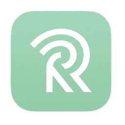

# Rosser

Rosser is a self-hosted, cross-platform RSS reader. It brings a desktop client, a mobile H5 interface, and a unified web entry under one lightweight backend, so you can follow your feeds on your own infrastructure.

English | [中文说明](README_CN.md)



## Architecture

- **Backend**: FastAPI + SQLAlchemy(async) + SQLite + Alembic + APScheduler
- **Desktop**: Tauri + Vue3 + Vite + Naive UI
- **Mobile**: Vue3 + Vite + Tailwind CSS + Pinia + Vue Router + Vue I18n (H5, remote only)
- **Shared**: TypeScript monorepo package with OpenAPI-generated types

## Development

### Prerequisites

- [uv](https://docs.astral.sh/uv/) (Python 3.12+)
- [pnpm](https://pnpm.io/) 9+
- [Node.js](https://nodejs.org/) 20+

### Setup

```bash
# Install dependencies
pnpm install
cd src/backend && uv sync --extra dev

# Start everything (backend + frontend + mobile)
pnpm dev
```

### Scripts

| Command | Description |
|---------|-------------|
| `pnpm dev` | Start backend, frontend, and mobile concurrently |
| `pnpm dev:backend` | Start FastAPI backend only |
| `pnpm dev:frontend` | Start desktop frontend (Vite dev server) |
| `pnpm dev:mobile` | Start mobile frontend (Vite dev server) |
| `pnpm gen:api` | Regenerate OpenAPI types from backend |
| `pnpm build` | Build all frontend packages |

### Backend

```bash
cd src/backend
uv run python -m app.main
```

API docs available at `http://127.0.0.1:8000/docs`.

### Desktop (Remote Mode)

```bash
pnpm --filter @rosser/frontend dev:vite
```

### Mobile

```bash
# Development server
pnpm --filter @rosser/mobile dev

# Unit tests
pnpm --filter @rosser/mobile test

# E2E tests
pnpm --filter @rosser/mobile test:e2e
```

## Deployment

### Docker

The project root includes a full-stack `docker-compose.yml` that starts the backend, the web frontend (remote mode), the mobile H5 app, and an optional unified entry proxy:

```bash
cp .env.example .env
# Edit .env, at least change ROSSER_TOKEN
docker compose up -d
```

After deployment:

- Backend API: `http://localhost:8000`
- Frontend standalone: `http://localhost:8001`
- Mobile H5 standalone: `http://localhost:8002`
- Unified entry (auto-routes to frontend/mobile by UA): `http://localhost:8003`

Unified entry rules:

- `/api/*` → backend API
- `/ws` → backend WebSocket
- `/` and static assets → desktop UA goes to frontend, mobile UA goes to mobile

When opening the frontend or mobile app for the first time, set the backend URL to `http://localhost:8000` and enter `ROSSER_TOKEN`. If you access through the unified entry at `http://localhost:8003`, you can also set the backend URL to `http://localhost:8003` (API requests are proxied to the backend automatically).

> Backend data and files are persisted in the `./data` and `./storage` directory volumes at the project root. They survive container recreation and upgrades.

### Environment Variables

| Variable | Default | Description |
|----------|---------|-------------|
| `ROSSER_TOKEN` | `dev-token-change-me` | Bearer token for authentication |
| `ROSSER_HOST` | `0.0.0.0` | Bind address |
| `ROSSER_PORT` | `8000` | Backend listen port |
| `ROSSER_DATA_DIR` | `~/.rosser/data` | SQLite database directory |
| `ROSSER_STORAGE_DIR` | `~/.rosser/storage` | File storage directory |
| `ROSSER_RELOAD` | `0` | Set to `1`/`true` to enable auto-reload (development only) |
| `ROSSER_CORS_ORIGINS` | `http://localhost:8001,...` | Allowed CORS origins |
| `ROSSER_FRONTEND_PORT` | `8001` | Frontend exposed host port |
| `ROSSER_MOBILE_PORT` | `8002` | Mobile H5 exposed host port |
| `ROSSER_PROXY_PORT` | `8003` | Unified proxy exposed host port |

## License

GPL-3.0
